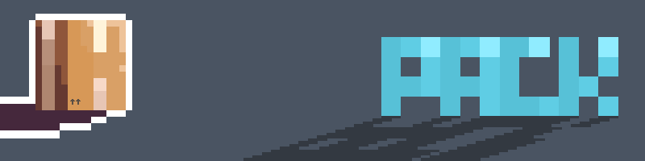
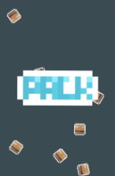
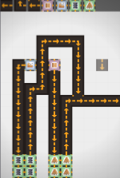
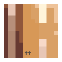

# PACK - REWY (06/03/2025)

my major software engineering project

## Project Showcase

### Description

A small factory game about files, packages, trucks and more, made as a fun way of learning fundamental aspects of the software engineering design process.

* * *
### Instalation Instructions

This is a chrome extension game intended to be installed of the chrome extension store under the name: “PACK!” by ryan

* * *
### How To Use

__KeyBinds:__

Action | Key 
 ------------ | ------------- 
Place Structure | “1”, then, “M1/Click” 
Delete Structures | “e”, then,  “click/M1” 
Rotate Tiles | “r” 
Flip Tiles | “f/u” 
Change Tile | “t” 
Open Settings | “NA” 

* * *
### License Information

Under the google chrome extensions licence and created by Me the projects Assets and designs are all made by Me and should not be taken or misused.

please contact me if you would like to use my game or assets in a video or your own projects.

* * *
### Visuals

***

 
 

* * *
### Acknowledgements

This Project has been made on VSCode and I have used ChatGPT, w3schools, stacks, and other websites to gain knowledge on coding syntax and how key functions such as a tiling system work. 

* * *
### Author Details 

This project was made completely by me, Ryan Hanna including all pixel art sprites and code. 

#### Contacts:  

- Online Name: Rewy or Rewy10 

- Email: ry007h@gmail.com 

- Phone: 0492803235 

* * *
### Additional Details

ENJOY (;